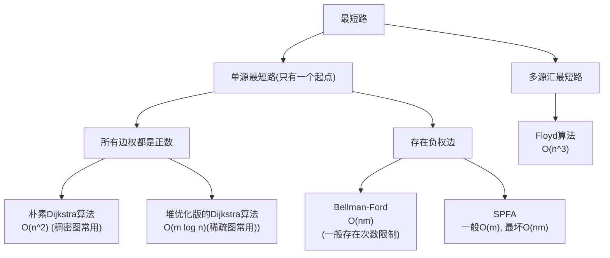
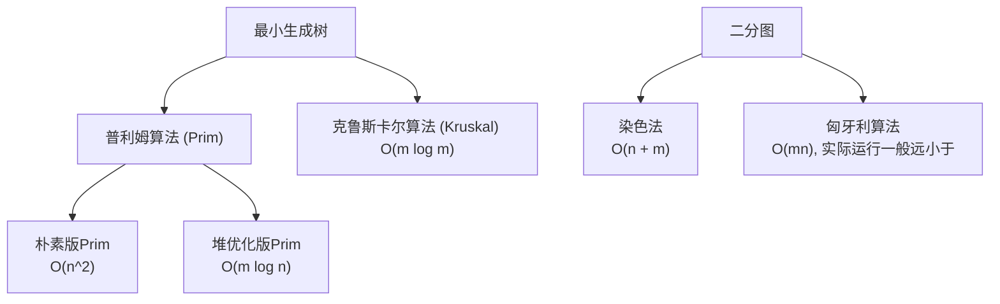

# 搜索与图论

图是计算机科学中描述关系与网络的核心模型。在众多图论问题中，**最短路径**与**最小生成树**是最基础也最经典的两类问题，广泛应用于路径规划、网络设计、社交分析等领域。本文整理了求解最短路径（包括单源与多源情形）、构建最小生成树，以及二分图的判定与最大匹配等核心算法。

# 最短路算法结构图：



# 最小生成树与二分图算法结构图：



## 朴素版 Dijkstra

适用于：边权全为正的稠密图（m≈n2 ），使用邻接矩阵存储。

### 思路

```c++
Dijkstra 是基于贪心策略的单源最短路算法，要求所有边权为正。
1. 维护集合 S：S 中的点已确定最短路径。
2. 初始化：源点 dist[1] = 0，其余为 INF。
3. 重复 n 次：从 S 外选出 dist 最小的点 t（贪心选择），将 t 加入 S（此时 dist[t] 已是最短路），再用 t 松弛其所有邻接点（尝试通过 t 缩短其他点的距离）。
```

### [具体问题：Dijkstra求最短路 I](https://www.acwing.com/problem/content/851/)

```cpp
#include <iostream>
#include <cstring>
#include <algorithm>
using namespace std;

const int N = 510;
const int INF = 0x3f3f3f3f;

int g[N][N];    // 邻接矩阵：g[i][j] 表示 i→j 的边权
int dist[N];    // dist[i]：1 到 i 的最短距离
bool visited[N]; // visited[i] = true 表示 i 已确定最短路（不可逆）
int n, m;

int dijkstra() {
    memset(dist, 0x3f, sizeof dist);
    dist[1] = 0;

    for (int i = 1; i <= n; i++) {
        // 在未确定最短路的点中找 dist 最小的
        int t = -1;
        for (int j = 1; j <= n; j++)
            if (!visited[j] && (t == -1 || dist[j] < dist[t]))
                t = j;

        visited[t] = true;  // 加入集合 S，最短路已确定

        // 用 t 更新所有邻接点（邻接矩阵遍历所有点）
        for (int j = 1; j <= n; j++)
            dist[j] = min(dist[j], dist[t] + g[t][j]);
    }

    // Dijkstra 无负权，不连通点保持 INF（无需 /2）
    if (dist[n] == INF) return -1;
    return dist[n];
}

int main() {
    cin >> n >> m;

    // 邻接矩阵初始化：无边则为 INF，自己到自己为 0
    memset(g, 0x3f, sizeof g);
    while (m--) {
        int x, y, c;
        cin >> x >> y >> c;
        g[x][y] = min(g[x][y], c);  // 重边保留最小值
    }

    cout << dijkstra() << endl;
    return 0;
}
```

## 堆优化版 Dijkstra

适用于：边权全为正的稀疏图（m≪n2 ），使用邻接表存储。

### 思路

```c++
朴素 Dijkstra 的瓶颈在于“找最小点”为 O(n)。
堆优化版用小根堆维护未确定最短路的点，将找最小点优化到 O(log n)：
1. 初始化：dist[1] = 0，将 (0, 1) 入堆。
2. 当堆非空：首先弹出堆顶 (distance, ver)，若 ver 已确定最短路则跳过，否则标记 ver 为已确定，再遍历 ver 的邻接点，尝试松弛，若成功则将 (new_dist, j) 入堆。
堆中可能存在同一节点的多个冗余副本，靠 st[] 去重。
```

### [具体问题：Dijkstra求最短路 II](https://www.acwing.com/problem/content/852/)

```cpp
#include<iostream>
#include<cstring>
#include<queue>

using namespace std;

typedef pair<int, int> PII;

const int N = 100010; // 把N改为150010就能ac

// 稀疏图用邻接表来存
int h[N], e[N], ne[N], idx;
int w[N]; // 用来存权重
int dist[N];
bool st[N]; // 如果为true说明这个点的最短路径已经确定

int n, m;

void add(int x, int y, int c)
{
    // 有重边也不要紧，假设1->2有权重为2和3的边，再遍历到点1的时候2号点的距离会更新两次放入堆中
    // 这样堆中会有很多冗余的点，但是在弹出的时候还是会弹出最小值2+x（x为之前确定的最短路径）
    // 并标记st为true，所以下一次弹出3+x会continue不会向下执行。
    w[idx] = c;
    e[idx] = y;
    ne[idx] = h[x]; 
    h[x] = idx++;
}

int dijkstra()
{
    memset(dist, 0x3f, sizeof(dist));
    dist[1] = 0;
    priority_queue<PII, vector<PII>, greater<PII>> heap; // 定义一个小根堆
    // 这里heap中为什么要存pair：首先小根堆是根据距离来排的，所以有一个变量要是距离；其次在从堆中拿出来的时候要知道知道这个点是哪个点，不然怎么更新邻接点呢？所以第二个变量要存点。
    heap.push({ 0, 1 }); // 这个顺序不能倒，pair排序时是先根据first，再根据second，
                         // 这里显然要根据距离排序
    while(heap.size())
    {
        PII k = heap.top(); // 取不在集合S中距离最短的点
        heap.pop();
        int ver = k.second, distance = k.first;

        if(st[ver]) continue;
        st[ver] = true;

        for(int i = h[ver]; i != -1; i = ne[i])
        {
            int j = e[i]; // i只是个下标，e中在存的是i这个下标对应的点。
            if(dist[j] > distance + w[i])
            {
                dist[j] = distance + w[i];
                heap.push({ dist[j], j });
            }
        }
    }
    if(dist[n] == 0x3f3f3f3f) return -1;
    else return dist[n];
}

int main()
{
    memset(h, -1, sizeof(h));
    scanf("%d%d", &n, &m);

    while (m--)
    {
        int x, y, c;
        scanf("%d%d%d", &x, &y, &c);
        add(x, y, c);
    }

    cout << dijkstra() << endl;

    return 0;
}
```

## Bellman-Ford 算法

适用于：存在负权边、限制路径边数、检测负环前驱

### 思路

```c++
Bellman-Ford 算法通过“松弛操作”对所有边进行最多 k 轮更新（k 为允许的最多边数）。
1. 初始化：源点距离为 0，其余为无穷大。
2. 进行 k 次循环，每次用上一轮的距离（用备份数组 back 保证不发生“串联更新”）去尝试松弛每条边。
3. 若某轮没有发生任何更新，可提前终止（但通常不加，因 k 有限）。
```

### [具体问题：有边数限制的最短路](https://www.acwing.com/problem/content/855/)

```cpp
#include <iostream>
#include <cstring>
using namespace std;

const int N = 510, M = 10010;

struct Edge {
    int a, b, w;
} e[M];

int dist[N], back[N];
int n, m, k;

int bellman_ford() {
    memset(dist, 0x3f, sizeof dist);
    dist[1] = 0;
    for (int i = 0; i < k; i++) {           // 最多 k 条边
        memcpy(back, dist, sizeof dist);     // 备份上一轮结果
        for (int j = 0; j < m; j++) {
            int a = e[j].a, b = e[j].b, w = e[j].w;
            dist[b] = min(dist[b], back[a] + w);  // 用 back[a] 防止串联
        }
    }
    // 因为可能存在负权边，即使不连通也可能被更新到略小于 INF，故用 INF/2 判断
    if (dist[n] > 0x3f3f3f3f / 2) return -1;
    return dist[n];
}

int main() {
    cin >> n >> m >> k;
    for (int i = 0; i < m; i++) {
        int a, b, w;
        cin >> a >> b >> w;
        e[i] = {a, b, w};
    }
    int res = bellman_ford();
    if (res == -1) puts("impossible");
    else cout << res << endl;
    return 0;
}
```

## SPFA 算法（队列优化的 Bellman-Ford）

适用于：稀疏图、含负权边（但无负环）、一般最短路问题

### 思路

```c++
SPFA 是 Bellman-Ford 的优化版本：
1. 仅当某点距离被更新时，才将其加入队列，用于后续松弛其邻接点。
2. 用 st[] 数组标记点是否在队列中，避免重复入队（提升效率，非必需但推荐）。
3. 出队后 st[t] = false，允许该点后续再次入队（与 Dijkstra 的 st 不可逆不同）。
SPFA 不能处理存在负权环的图（会死循环），若需判负环，需额外维护 cnt[] 记录路径边数。
```

### [具体问题：spfa判断负环](https://www.acwing.com/problem/content/854/)

```cpp
#include <iostream>
#include <queue>
#include <cstring>
using namespace std;

const int N = 1e5 + 10;

int h[N], e[N], w[N], ne[N], idx;
int dist[N];
bool st[N];  // st[x] 表示 x 是否在队列中
int n, m;

void add(int a, int b, int c) {
    e[idx] = b, w[idx] = c, ne[idx] = h[a], h[a] = idx++;
}

int spfa() {
    memset(dist, 0x3f, sizeof dist);
    dist[1] = 0;
    queue<int> q;           // 实际无需存 pair，直接存点编号即可
    q.push(1);
    st[1] = true;

    while (q.size()) {
        int t = q.front();
        q.pop();
        st[t] = false;      // 出队后允许再次入队

        for (int i = h[t]; ~i; i = ne[i]) {
            int j = e[i];
            if (dist[j] > dist[t] + w[i]) {
                dist[j] = dist[t] + w[i];
                if (!st[j]) {   // 未在队列中才入队
                    q.push(j);
                    st[j] = true;
                }
            }
        }
    }
    // SPFA 只更新与源点连通的点，不连通则保持 INF
    if (dist[n] == 0x3f3f3f3f) return -1;
    return dist[n];
}

int main() {
    cin >> n >> m;
    memset(h, -1, sizeof h);
    while (m--) {
        int a, b, c;
        cin >> a >> b >> c;
        add(a, b, c);
    }
    int res = spfa();
    if (res == -1) puts("impossible");
    else cout << res << endl;
    return 0;
}
```

## Floyd 算法

**适用于：多源最短路、稠密图、需查询任意两点间距离**

### 思路

```c++
Floyd 是典型的动态规划算法：
定义 d[i][j] 表示从 i 到 j 的最短距离。
状态转移：d[i][j] = min(d[i][j], d[i][k] + d[k][j])
枚举中间点 k，尝试用 k 作为中转更新所有点对 (i, j)。
```

### [具体问题：Floyd求最短路](https://www.acwing.com/problem/content/856/)

```cpp
#include <iostream>
using namespace std;

const int N = 210, INF = 1e9;

int d[N][N];
int n, m, k;

void floyd() {
    for (int k = 1; k <= n; k++)
        for (int i = 1; i <= n; i++)
            for (int j = 1; j <= n; j++)
                d[i][j] = min(d[i][j], d[i][k] + d[k][j]);
}

int main() {
    cin >> n >> m >> k;
    // 初始化距离矩阵
    for (int i = 1; i <= n; i++)
        for (int j = 1; j <= n; j++)
            if (i == j) d[i][j] = 0;
            else d[i][j] = INF;

    while (m--) {
        int x, y, z;
        cin >> x >> y >> z;
        d[x][y] = min(d[x][y], z);  // 保留重边中的最小值
    }

    floyd();

    while (k--) {
        int x, y;
        cin >> x >> y;
        // 因存在负权边，即使不连通也可能被更新到略小于 INF
        if (d[x][y] > INF / 2) puts("impossible");
        else cout << d[x][y] << endl;
    }
    return 0;
}
```

###### 

## 朴素版 Prim 算法

适用于：稠密图（$m \approx n^2$），使用邻接矩阵存储

### 思路

```c++
Prim 算法基于贪心策略，逐步扩展最小生成树（MST）：
1. 初始化：任选一点（如 1 号点）作为起点，其到 MST 距离为 0，其余为 INF。
2. 重复 n 次：
     1.从未加入 MST 的点中选出到 MST 距离最小的点 t；
     2.若该距离为 INF，说明图不连通，无法生成 MST；
     3.将 t 加入 MST，累加其距离到总权值；
     4.用 t 更新所有未加入 MST 的邻接点到 MST 的距离（取 min(g[t][j], dt[j])）。
dt[i] 表示点 i 到当前 MST 的最短边权（不是到源点的距离）
```

### [具体问题：Prim算法求最小生成树](https://www.acwing.com/problem/content/860/)

```cpp
#include <iostream>
#include <cstring>
#include <algorithm>
using namespace std;

const int N = 510;
const int INF = 0x3f3f3f3f;

int g[N][N];    // 邻接矩阵：无向图，g[a][b] = g[b][a]
int dt[N];      // dt[i]：点 i 到当前 MST 的最短距离
bool st[N];     // st[i] = true 表示 i 已加入 MST
int n, m;

int prim() {
    memset(dt, 0x3f, sizeof dt);
    dt[1] = 0;  // 从 1 号点开始

    int res = 0;
    for (int i = 0; i < n; i++) {
        // 找未加入 MST 中距离最小的点
        int t = -1;
        for (int j = 1; j <= n; j++)
            if (!st[j] && (t == -1 || dt[j] < dt[t]))
                t = j;

        // 若最小距离仍为 INF，说明图不连通
        if (dt[t] == INF) return INF;

        st[t] = true;
        res += dt[t];

        // 用 t 更新其他点到 MST 的距离
        for (int j = 1; j <= n; j++)
            if (!st[j])  // 只更新未加入 MST 的点
                dt[j] = min(dt[j], g[t][j]);
    }
    return res;
}

int main() {
    cin >> n >> m;
    memset(g, 0x3f, sizeof g);

    while (m--) {
        int a, b, w;
        cin >> a >> b >> w;
        // 无向图，保留重边中的最小值
        g[a][b] = g[b][a] = min(g[a][b], w);
    }

    int res = prim();
    if (res == INF) puts("impossible");
    else cout << res << endl;
    return 0;
}
```

## Kruskal 算法

适用于：稀疏图（$m \ll n^2$），使用边集数组 + 并查集

### 思路

```c++
Kruskal 算法基于贪心 + 并查集：
1. 将所有边按权重从小到大排序；
2. 依次枚举每条边 (a, b, w)：若 a 和 b 不在同一连通块（find(a) != find(b)），则加入 MST且合并 a、b 所在集合，累加 w；
3. 若最终 MST 边数 = n - 1，则成功；否则图不连通。
```

### [具体问题: Kruskal算法求最小生成树](https://www.acwing.com/problem/content/861/)

```cpp
#include <iostream>
#include <algorithm>
#include <cstring>
using namespace std;

const int N = 200010;
const int INF = 0x3f3f3f3f;

struct Edge {
    int a, b, w;
    bool operator< (const Edge &e) const {
        return w < e.w;
    }
} edges[N];

int p[N];  // 并查集父节点数组
int n, m;

int find(int x) {
    if (p[x] != x) p[x] = find(p[x]);
    return p[x];
}

int kruskal() {
    // 初始化并查集：每个点自成一集合
    for (int i = 1; i <= n; i++) p[i] = i;

    sort(edges, edges + m);  // 按边权排序

    int res = 0, cnt = 0;  // cnt: 当前 MST 边数
    for (int i = 0; i < m; i++) {
        int a = edges[i].a, b = edges[i].b, w = edges[i].w;
        if (find(a) != find(b)) {
            p[find(a)] = find(b);  // 合并集合
            res += w;
            cnt++;
        }
    }
    // 树有 n 个点需 n-1 条边
    if (cnt == n - 1) return res;
    return INF;
}

int main() {
    cin >> n >> m;
    for (int i = 0; i < m; i++) {
        int a, b, w;
        cin >> a >> b >> w;
        edges[i] = {a, b, w};
    }

    int res = kruskal();
    if (res == INF) puts("impossible");
    else cout << res << endl;
    return 0;
}
```

## 染色法判断二分图

适用于：判断无向图是否为二分图（即能否二染色）

### 思路

```c++
二分图: 图中不含奇数环。
染色法使用 DFS/BFS 给图染两种颜色（如 1 和 2）：
1. 遍历每个未染色的点，从它开始 DFS；
2. 将当前点染为颜色 c；
3. 遍历其邻接点：若未染色，则染为 3 - c，递归处理；若已染色且≠ 3 - c，则冲突，不是二分图。
```

### [具体问题：染色法判定二分图](https://www.acwing.com/activity/content/problem/content/926/)

```cpp
#include <iostream>
#include <cstring>
#include <algorithm>
using namespace std;

const int N = 100010 * 2;

int h[N], e[N], ne[N], idx;//邻接表存储图
int color[N];  //保存各个点的颜色，0 未染色，1 是红色，2 是黑色
int n, m;

void add(int a, int b){ //邻接表插入点和边
    e[idx] = b, ne[idx]= h[a], h[a] = idx++;
}

bool dfs(int u, int c){ //深度优先遍历
    color[u] = c;//u的点成 c 染色

    //遍历和 u 相邻的点
    for(int i = h[u]; i!= -1; i = ne[i]){

        int b = e[i];                   
        if(!color[b]){ //相邻的点没有颜色,则递归处理这个相邻点
            if(!dfs(b, 3 - c)) return false;//（3 - 1 = 2， 如果 u 的颜色是2，则和 u 相邻的染成 1）
                                            //（3 - 2 = 1， 如果 u 的颜色是1，则和 u 相邻的染成 2）
        }
        else if(color[b] && color[b] != 3 - c){ //如果已经染色，判断颜色是否为 3 - c                                
            return false;//如果不是，说明冲突，返回                   
        }
    }
    return true;
}

int main(){
    memset(h, -1, sizeof h);//初始化邻接表
    cin >> n >> m;
    for(int i = 1; i <= m; i++){ //读入边
        int a, b;
        cin >> a >> b;
        add(a, b), add(b, a);
    }
    for(int i = 1; i <= n; i++){ //遍历点
        if(!color[i]){  //如果没染色
            if(!dfs(i, 1)){ //染色该点，并递归处理和它相邻的点
                cout << "No" << endl;//出现矛盾，输出NO 
                return 0;
            }
        }
    }
    cout << "Yes" << endl;//全部染色完成，没有矛盾，输出YES
    return 0;
}
```

## 匈牙利算法（求最大匹配）

适用于：二分图最大匹配（如男女配对、任务分配）

### 思路

```c++
匈牙利算法通过“增广路径”增加匹配数：
1. 对左侧每个点 u，尝试为其找匹配：
      1.遍历 u 的所有邻接点 v；
      2.若 v 未被访问（本次尝试中），标记为已访问；
      3.若 v 未匹配，或 v 的当前匹配点 match[v] 能找到新匹配，将 v 匹配给 u。
2. 每次尝试前需重置 st[]（本次 DFS 的访问标记）。
 st[]防止在一次 find(u) 中重复访问同一右侧点，避免死循环。
```

### [具体问题：二分图的最大匹配](https://www.acwing.com/problem/content/863/)

```cpp
#include <iostream>
#include <cstring>
#include <algorithm>
using namespace std;

const int N = 510, M = 100010;

int h[N], e[M], ne[M], idx;
int match[N];  // match[j] = i 表示右侧点 j 与左侧点 i 匹配
bool st[N];    // st[j]：在本次 find 中 j 是否已被尝试
int n1, n2, m; // n1: 左侧点数, n2: 右侧点数

//存图函数
void add(int a, int b){
    e[idx] = b, ne[idx] = h[a]; h[a] = idx++;
}
//递归找可以匹配的点
bool find(int x){
    // 和各个点尝试能否匹配
    for(int i = h[x]; i != -1; i = ne[i]){
        int b = e[i];
        if(!st[b]){//打标记
            st[b] = 1;
            // 当前尝试点没有被匹配或者和当前尝试点匹配的那个点可以换另一个匹配
            if(match[b] == 0 || find(match[b])){
                // 和当前尝试点匹配在一起
                match[b] = x;
                return true;
            }
        }
    }
    return false;
}

int main(){
    memset(h, -1, sizeof h);
    cin >> n1 >> n2 >> m;
    // 保存图，因为只从一遍找另一边，所以该无向图只需要存储一个方向
    for(int i = 0; i < m; i++){
        int a, b;
        cin >> a >> b;
        add(a, b);
    }
    int res = 0;
    //为各个点找匹配
    for(int i = 1; i <= n1; i++){
        memset(st, 0, sizeof st);
        //找到匹配
        if(find(i)) res++;
    }
    cout << res;
    return 0;
}
```
